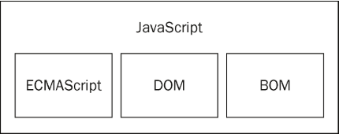
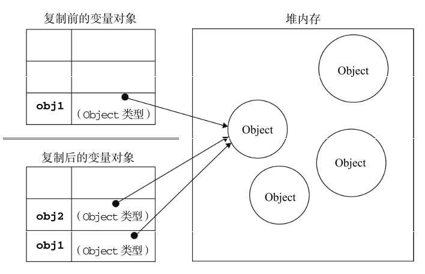

# Javascript高级程序设计语言 笔记

---

## 0x00 写在前面

在开始写笔记的时候 第四版已经出版了 而且已经在翻译了

等第四版出来了 会更新的补充这个笔记的

---

## 0x01 JavaScript 简介

### JavaScript 实现

一个完整的 JavaScript 实现应该由下列三个不同的部分实现

- 核心 ECMAScript
- 文档对象模型 DOM
  - 提供访问和操作网页内容的方法和接口
- 浏览器对象模型 BOM
  - 提供与浏览器交互的方法和接口



## 0x02 在HTML中使用JavaScript

### `<script>`元素

- `async` 
  - 可选 表示立即下载脚本 但不应妨碍页面中的其他操作
  - **只对外部脚本有效**
- `charset`
  - 可选 表示通过 src 属性指定的代码的字符集
  - 由于大多数浏览器会忽略它的值 因此这个属性很少有人用
- `defer`
  - 可选 表示脚本可以延迟到文档完全被解析和显示之后再执行
  - 只对外部脚本文件有效
- `src`
  - 可选 表示包含要执行代码的外部文件
- `type` 可选 表示编写代码使用的脚本语言的内容类型 亦称`MIME`类型
  - 默认都是 `text/javascript`

只要不存在 defer 和 async 属性

浏览器都会按照`<script>`元素在页面中出现的先后顺序对它们依次进行解析

### 标签的位置

传统一般放在`<head>`元素中

在文档的`<head>`元素中包含所有 JavaScript文件

意味着必须等到全部 JavaScript代码都被下载  解析和执行完成以后 才能开始呈现页面的内容

现在一般都放在`<body>`元素页面内容的后面

#### 延迟脚本

`defer`属性 表明脚本在执行时不会影响页面的构造

```html
<script defer="defer" type="text/javascript" src="eg.js"></script>
```

相当于告诉浏览器立即下载 但延迟执行

这两个脚本会先于 `DOMContentLoaded`事件执行

在现实当中 延迟脚本并不一定会按照顺序执行

也不一定会在 `DOMContentLoaded` 事件触发 前执行 因此最好**只包含一个延迟脚本**

在`HTML5`中只支持外部脚本


#### 异步脚本

```html
<script type="text/javascript" async src="example1.js"></script> 
<script type="text/javascript" async src="example2.js"></script>
```

在以上代码中 第二个脚本文件可能会在第一个脚本文件之前执行

因此，确保两者之间**互不依赖**非常重要

指定 async 属性的目的是不让页面等待两个脚本下载和执行，从而异步加载页面其他内容

异步脚本不要在加载期间修改DOM

异步脚本一定会在页面的 `load` 事件前执行

但可能会在 `DOMContentLoaded` 事件触发之前或之后执行

### 外部脚本

引入外部脚本有很多好处

- 可维护性
- 可缓存
- 适应未来


### `<noscript>` 元素

- 浏览器不支持脚本
- 支持脚本 但是脚本被禁用

符号以上任何一个条件 就会显示该标签内的内容


## 0x03 基本概念

### 语法

- **区分大小写**

- 变量开头 必须是 **字母 下划线 美刀符号**

- 注释

  - ```javascript
    // Single line
    /*
     *  Multiline
     */ 
    ```

- 严格模式

  - ES6中默认开启

- 使用分号作为结束标志

- 关键字 和 保留字


### 数据类型

基本数据类型

`Undefined Null Boolean Number String`

复杂数据类型 `Object`　：本质上是由一组无序的名值对组成的

#### typeof

检测变量的类型

```javascript
alert (typeof null); // object
```

#### undefined 类型

```javascript
var message;
message; // undefined
var demo = undefined; // 显式声明
```

#### null 类型

实际上 `undefined`是`null`的衍生值

```javascript
null == undefined; // true
```

#### Boolean 类型

只有`true`和`false` 注意大小写

可以调用`Boolean()`对其他值进行强制转换

| 数据类型  | 转换为`true`的值     | 转换为`false`的值 |
| --------- | -------------------- | ----------------- |
| Boolean   | `true`               | `false`           |
| String    | 非空字符串           | 空字符串          |
| Number    | 非0数字值 包括无穷大 | 0和`NaN`          |
| Object    | 任何对象             | `null`            |
| Undefined | -                    | `undefined`       |

#### Number 类型

代码比较易懂

```javascript
var intNum = 6;
var octalNum = 070;
var hexNum = 0xA;
var floatNum = 1.1;
var floatENum = 3.125e7;
```

由于使用`IEEE754`进行数值计算 对浮点数的精度会有影响

```javascript
if (0.1 + 0.2 === 0.3){ // 永远不相等
}
// 0.1 + 0.2 的结果是 0.30000000000000004
```

由于内存限制 数值的大小是有界限的

`Number.MAX_VALUE` `Number_MIN_VALUE` 值是 `1.7976931348623157e+308`

如果超过了这个上限 值将会被认为是 `Infinity` 如果是负数 `-Infinity`

这个值将无法参与后续的运算

```javascript
isFinite(num);
// 可以检测是不是这两种类型的数值
```

如果在数字运算中 本来应该返回数字的运算有问题 那么就会返回`NaN` 即 Not a Number

如0除以0 

[^真实情况]:只有0除以0才是`NaN` 正数除以0返回 `Infinity` 负数除以0返回`-Infinity`

任何数与`NaN`进行运算 得到的也是`NaN`

```javascript
NaN === NaN ; // false
isNaN(NaN); // true
isNaN("10"); // false : "10" --> 10
isNaN("Blue"); // true
isNaN(true); // false : true --> 1
```

[^isNaN]:调用该方法的时候 会先调用对象的`valueOf()` 确定是否可以转换为数值 如果不行 继续调用`toString()`方法

##### 数值转换

`Number()` 可以对任何值使用

- Boolean
  - 1或 0
- 数字值
- `null`
  - 返回0
- `undefined`
  - `NaN`
- 字符串
  - 只包含数字 包括正负号 转换成十进制
  - 浮点数格式 转换成浮点数
  - 十六进制数 转换成相同大小的十进制
  - 空
    - 0
  - 其他字符
    - `NaN`
- 对象
  - `valueOf()` 再按照规则进行考虑 若`NaN`
  - `toString()` 进行考虑

`parseInt()`

- 忽略字符串前面的空格 直到找到第一个数字字符或者负号
- 如果不是 返回`NaN`
- 忽略小数点 因为不是`int`

一般会用两个参数 用来指定进制

```javascript
var num = parseInt("0xAF", 16);
```

`parseFloat()` 同理


#### String 类型

使用单引号或者双引号括起来

```javascript
var firstName = "Sonder";
var lastName = 'Lau';
```


#####  字符串面量

| 字面量  | 含义        |
| ------- | ----------- |
| `\n`    | 换行        |
| `\t`    | 制表符      |
| `\b`    | 空格        |
| `\r`    | 回车        |
| `\f`    | 进纸 (?)    |
| `\\`    | 即 \        |
| `\'`    | 单引号      |
| `\"`    | 双引号      |
| `\xnn`  | 十六进制    |
| `\unnn` | Unicode字符 |


##### length

任何字符串都有一个`length`值 用来储存长度

```javascript
var text ="SonderLau";
text.length; // 9
```


#####  拼接

```javascript
var lang = "java";
lang = lang + "Script";
```

通过 `+` 对字符串进行拼接


#####  转换为字符串

- `toString()`
  - 几乎所有的值都可以这样
  - **`null` `undefined`值没有这个方法** 
  - 可以加入参数 代表指定进制
- `String()`
  - 如果该值有`toString()` 则调用该方法
  - 如果是`null` 返回`null`
  - 如果是`undefined` 返回`undefined`


#### Obejcet 类型

```javascript
var obj = new Object();
```

类似`Java`

每个`Object`都有以下的属性和方法

- `constructor` 构造函数
- `hasOwnProperty (propertyName)` 检查属性是否在当前的实例中 参数必须以字符串形式
- `isPrototypeOf (obejct)`检查传入的对象是否是传入对象的**原型**
- `propertyIsEnumerable (propertyName)` 用于检查给定的参数能否进行`for-in`枚举 同样参数需要字符串
- `toLocaleString ()` 返回对象的字符串表示 与执行环境的地区对应
- `toString()` 返回字符串表示
- `valueOf ()` 回对象的字符串 数值或布尔值表示


### 操作符

```javascript
var age = 18;
age++;
age--;

var string1 = "01";
var string2 = "1.1";

string1 = +string1; // 1
string2 = +string2; // 1.1
```


#### 位操作符

1. 按位非 NOT  `~`

2. 按位与 AND `&`

3. 按位或 OR `|`

4.  按位异或 `^`

5. 左移 `<<`

6. 有符号的右移 `>>`

7. 无符号的右移 `>>>`


#### 布尔操作符

`! && ||`


#### 相等操作符

`== 和 ===` 的不同 : 需要比较两个变量的类型


#### 条件操作符

```javascript
variable = boolea_experssion ? true_value : false_value;
```


#### 赋值操作符

```javascript
var num1 = 1, num2 = 2, num3 = 3;
var num = (5,2,1,0); // num : 0
```


### 语句

```javascript
if (condition){
    // statement 1
} else if (condition 2){
    // statement 2
} else {
    // statement 3
}
```


```javascript
do {
    // statement
} while (experssion);
```


```javascript
while (experssion) {
    // statement
}
```


```javascript
for (var i = 0 ; i < 5 ; i ++) {
    // statements
}
for (var property in windows){
    // statements
}
```


```javascript
var num = 0; 

outermost:
for (var i=0; i < 10; i++) { 
    for (var j=0; j < 10; j++) { 
        if (i == 5 && j == 5) {
        	break outermost;
		} 
        num++; 
	} 
} 
alert(num); //55
```


```javascript
with (experssion) {
    // statements
}
```

`with` 为了简化多次编写同一个对象的工作 但是不推荐使用 会降低性能


```javascript
switch (experssion) {
    case value: // statements
        break;
    default : // statements
}
```


### 函数

```javascript
function functionName (arg0, arg1, ... argN) {
    // statements
}
```

需要注意的是

- 不能把**函数**命名为 `eval` 或 `arguments`
- 不能把**参数**命名为 `eval` 或 `arguments`
- 不能出现**两个命名参数同名**的情况


所有的参数会被包装成一个 `arguments` 对象

**函数在JS中没有重载 Overload**


## 0x04 变量 作用域

### 基本类型 与 引用类型的问题

#### 动态属性

```javascript
var person = new Object();
persone.name = "SonderLau";
alert(person.name);

// 基本类型的值 是不能添加属性的
var name = "Dapao";
name.age = 40;
alert(name.age); // undefined
```


#### 复制变量值

基本类型的值复制 是将值赋值

而对象的复制 是对象引用的赋值

```javascript
var obj1 = new Object();
var obj2 = obj1;
obj1.name = "Nicholas";
alert(obj2.name); //"Nicholas"
```





#### 传递参数

传递参数的时候 是把值赋值给局部变量


#### 作用域

```javascript
var color = "blue";
function changeColor(){ 
    var anotherColor = "red"; 
    function swapColors(){
		var tempColor = anotherColor;
        anotherColor = color;
        color = tempColor;
		// 这里可以访问 color、anotherColor 和 tempColor 
    }
	// 这里可以访问 color 和 anotherColor，但不能访问 tempColor swapColors();
}
// 这里只能访问 color changeColor();
```


## 0x05 引用类型

### Object 类型

创建一个`Object`类型的对象 有两种方式

```javascript
var person = new Object ();
person.name = "Sonder";
person.age = 29;
```

另一种是用**对象字面量**的表示法

```javascript
var person = {
    name : "Sonder",
    age : 29
};
```

访问一个对象的属性使用点表示法 也可用方括号

```javascript
person.name;
person["name"];
var name = "name";
person[name];
```


### Array 类型

创建一个`Array` 即数组  使用新建对象的方法

```javascript
var colors = new Array();
var colors = new Array(20); // 提前知道长度
var colors = new Array("red","blue","green"); // 新建的时候就可以存储元素
```

 数组的长度 `colors.length`

这个属性 **不是只读的** 所以 `JavaScript`的数组长度是动态的

同时修改这个参数 可以增加数组的长度和减小长度


#### 检测数组

```javascript
if (value instanceof Array) {
    
}

if (Array.isArray(value)) {
    
}
```


`instanceof`操作符的局限性在于 不同的框架传入的数组 或者不同构造函数的数组 会导致两个不同的接结果

因此 ES5 中新增了一个方法 可以用来检测是不是数组


#### 栈方法

栈是一种 LIFO (Last-In-First-Out 后进先出) 的数据结构

```javascript
var colors = new Array();
var count = colors.push ("red","green");
count; // 2
count = colors.push("black");
count; //3

var item = colors.pop();
item; // "black"
colors.length; // 2
```


#### 队列方法

队列数据结构的访问规则是 FIFO (First-In-First-Out)

```javascript
var colors = new Array();
var count = colors.push("red","green");
count; // 2

count = colors.push("black");
count; // 3

var item = colors.shift();
item; // "red"
colors.length; // 2

// unshift() 方法可以在前端添加
colors.unshift("blue");
```


#### 重排序

数组中有两个方法 `reverse()` `sort()` 

```javascript
var values = [1, 2, 3, 4, 5];
value.reverse();
value; // 5,4,3,2,1

var values = [0, 1, 5, 10, 15];
values.sort();
values; // 0 1 10 15 5
```


`sort()`方法不像我们对于数的大小一般进行排序 

如果需要对大小进行排序 可以DIY一个排序函数

```javascript
function compare (value1, value2) {
    if (value1 < value2){
        return -1;
    } else if (value1 > value2) {
        return 1;
    }else {
        return 0;
    }
}

var values = [0, 1, 5, 10, 15];
values.sort(compare);
values; // 0 1 5 10 15
```


#### 操作方法

##### 拼接

```javascript
var colors = ["red","green","blue"];
var colorsEdited = colors.concat("yellow", ["black","brown"]);

alert(colors);  //red,green,blue 
alert(colorsEdited); //red,green,blue,yellow,black,brown
```

##### 剪切

```javascript
var colors = ["red", "green", "blue", "yellow", "purple"]; 
var colors2 = colors.slice(1); 
var colors3 = colors.slice(1,4);
alert(colors2); //green,blue,yellow,purple
alert(colors3); //green,blue,yellow
```

注意到 是类似于数学中 `( ]` 的区间 取右不取左

如果参数中有负数，那么将用数组的长度与负数相加 进行选取

```javascript
colors.slice(-2, -1);
colors.slice(3, 4);
```

这两个调用的结果是一样的

##### 删除 插入 替换 :: spllice()

```javascript
var colors = ["red", "green", "blue"]; 
var removed = colors.splice(0,1); 
// 删除第一项
alert(colors);
// green,blue 
alert(removed); 
// red，返回的数组中只包含一项

removed = colors.splice(1, 0, "yellow", "orange"); 
// 从位置 1 开始插入两项 
alert(colors); 
// green,yellow,orange,blue 
alert(removed);
// 返回的是一个空数组

removed = colors.splice(1, 1, "red", "purple"); 
// 插入两项，删除一项
alert(colors);
// green,red,purple,orange,blue
alert(removed);
// yellow，返回的数组中只包含一项
```

其语法如下 `array.splice(start[, deleteCount[, item1[, item2[, ...]]]])`

指定起始位置 删除元素的个数 后面的参数则是需要插入的新元素

对调用的数组产生改变 返回删除的元素


#### 位置方法

`indexOf()` `lastIndexOf()`

分别查找某个元素在数组中从起点开始 第一次出现的位置和 从结尾开始第一次出现的位置


#### 迭代方法

5个迭代方法 每个方法接受2个参数

- (可选)要在每一项运行的函数 该函数有三个参数
  - 数组项的值
  - 该项在数组中的位置
  - 数组对象本身
- 运行该函数的作用域对象 **影响`this`的值**


五个迭代方法的作用

- `every()` 对数组中的每一项运行指定函数 如果每一项都返回`true` 则返回`true`
- `filter()` 对数组中的每一项运行指定函数 返回该函数会返回`true`的项组成的数组
- `forEach()` 对数组中的每一项运行给定函数 无返回值
- `map()` 对数组中的每一项运行给定函数 返回每次函数调用的结果组成的数组
- `some()` 对数组中的每一项运行给定函数 如果存在有一项返回`true` 则返回`true`

其中比较相似的是`every()`和`some()` 类似于数学中的$\forall \ \exists$这两个符号

```javascript
var number = [1,2,3,4,5,6,7];

var everyResult = number.every(function (item, index, array){
    return item > 2;
})
everyResult; // false

var someResult = number.some(function (item, index, array){
    return item > 2;
})
someResult; // true
```

`filter()`根据字面意思 就是用来筛选的

```javascript
var numbers = [1,2,3,4,5,4,3,2,1];

var filterResult = numbers.filter(function (item, index, array){
    return item > 2;
})

filterResult; // [3,4,5,4,3]
```

`map()`是对原来函数每一项进项对应函数操作的操作

```javascript
var number = [1,2,3,4,5];

var mapResult = number.map(function (item, index, array){
    return item * 2;
})

mapResult; // [2,4,6,8,10]
```

`forEach()` 对于学过其他语言的应该比较熟悉 即进行简单的遍历 **没有返回值**

```javascript
var number = [1,2,3,4,5];

number.forEach(function (item, index, array){
    // do something...
})
```


#### 归并方法

`reduce()`  和 `reduceRight()`

两个方法类似 遍历所有的项 构建一个最终返回值

第一个是正序 第二个是倒序

接受四个参数

- 前一个之
- 当前值
- 项的索引
- 数组对象

```javascript
var values = [1,2,3,4,5];

var sum = values.reduce(function (prev, cur, index, array){
    return prev + cur;
})

sum; // 15
```


### Date 对象

创建一个Date对象 只需要`new`一个即可

```javascript
var now = new Date();
```


## 0x06 面向对象的程序设计

## 0x07 函数式表达


